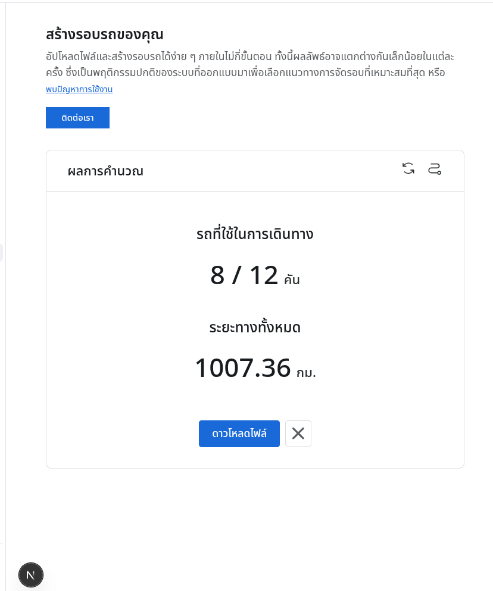
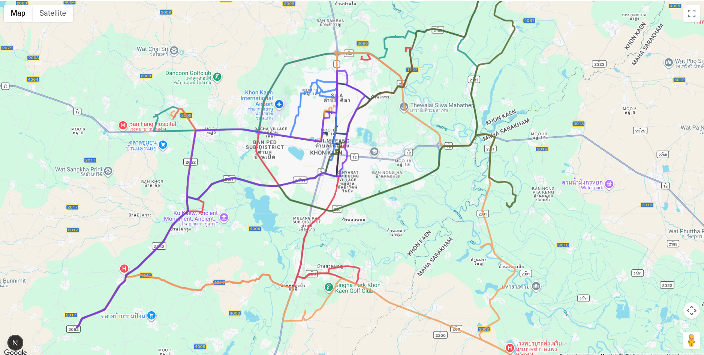
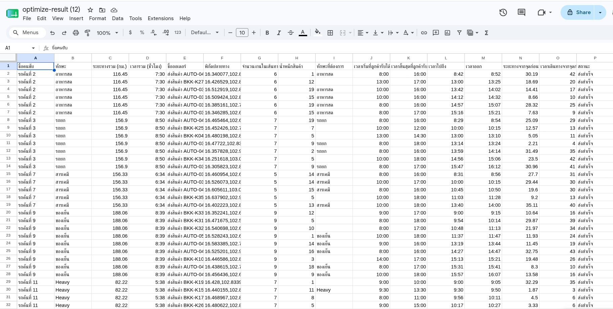

# Soroutetion

**Last Updated: 10 June 2026**

## Overview

Soroutetion is an automatic route optimization platform that applies Vehicle Routing Problem (VRP) techniques to support complex real-world transportation and field service operations.

The system currently supports **Heterogeneous Fleet Vehicle Routing Problem with Time Windows, Backhauls, Multi-Trip, and Priority Handling (HFVRPTWBMTPH)**.

At present, Soroutetion is still in the **prototype stage** and requires further research, development, testing, and validation to improve its stability, scalability, and optimization performance in production environments.

---

## Supported Optimization Features

### 1. Heterogeneous Fleet

The system supports multiple vehicle types with different capabilities and constraints, such as:

- Different vehicle capacities
- Different operating costs
- Different working speeds
- Different maximum workloads
- Vehicle-specific restrictions

This allows the optimizer to assign tasks to the most suitable vehicle instead of treating all vehicles equally.

---

### 2. Time Windows (TW)

Each task can define an acceptable service time period.

Example:

| Task       | Earliest Service Time | Latest Service Time |
| ---------- | --------------------- | ------------------- |
| Customer A | 08:00                 | 10:00               |
| Customer B | 13:00                 | 15:00               |

The optimizer attempts to generate routes that satisfy these service windows while minimizing operational costs.

---

### 3. Backhauls

The system supports scenarios where vehicles perform pickup activities after completing delivery or primary service tasks.

Examples include:

- Waste collection
- Parcel pickup
- Equipment retrieval
- Reverse logistics operations

Backhaul constraints are considered during route generation to maintain feasible vehicle loading conditions.

---

### 4. Multi-Trip

A vehicle can perform multiple trips during the planning horizon.

Example:

- Vehicle 1 completes a morning route
- Returns to depot
- Starts another route in the afternoon

This feature can significantly reduce the number of vehicles required.

---

### 5. Priority Handling

Tasks can be assigned different priority levels.

Examples:

- Emergency tasks
- High-priority customer requests
- Critical maintenance jobs

The optimizer attempts to prioritize important tasks while maintaining overall route efficiency.

---

## System Architecture

Current architecture consists of:

- Frontend (React / Next.js)
- Route Optimization Engine
- API Services
- Interactive Map Visualization
- CSV Import / Export

---

## Installation

### Clone Repository

```bash
git clone https://github.com/HacKaTechxRouteOptimize/Frontend
```

### Install Dependencies

```bash
npm install
```

### Start Development Server

```bash
npm run dev
```

The application will be available at:

```text
http://localhost:3000
```

---

## Configuration

Before running the system, verify that the API endpoint is correctly configured.

File:

```text
/src/app/api/baseApi.ts
```

Expected configuration:

```typescript
baseUrl: "https://soroutetion.com";
```

If the endpoint is configured correctly and backend services are available, the application should function normally.

---

## User Guide and Test Files

Documentation, example datasets, and testing files can be accessed through the following Google Drive folder:

https://drive.google.com/drive/folders/1ZnNWtNPHO2OMS1fZpKjwbhb8eVnsfijm?usp=sharing

---

## Optimization Results

After submitting optimization data, Soroutetion returns detailed routing results including:

### Summary Metrics

- Total distance traveled
- Total duration
- Number of vehicles used
- Route utilization statistics
- Optimization performance indicators

### Route-Level Results

For each vehicle:

- Assigned tasks
- Arrival time at each destination
- Departure time
- Route sequence
- Total route distance
- Total route duration

### Stop-Level Results

For each stop:

- Arrival time
- Departure time
- Distance from previous location
- Travel duration from previous location
- Service information
- Constraint validation status

### Exported CSV Results

Users can export detailed results in CSV format for further analysis, reporting, or integration with external systems.

---

## Screenshots

<p align="center">
  
</p>

<p align="center">
  
</p>

<p align="center">
  
</p>
